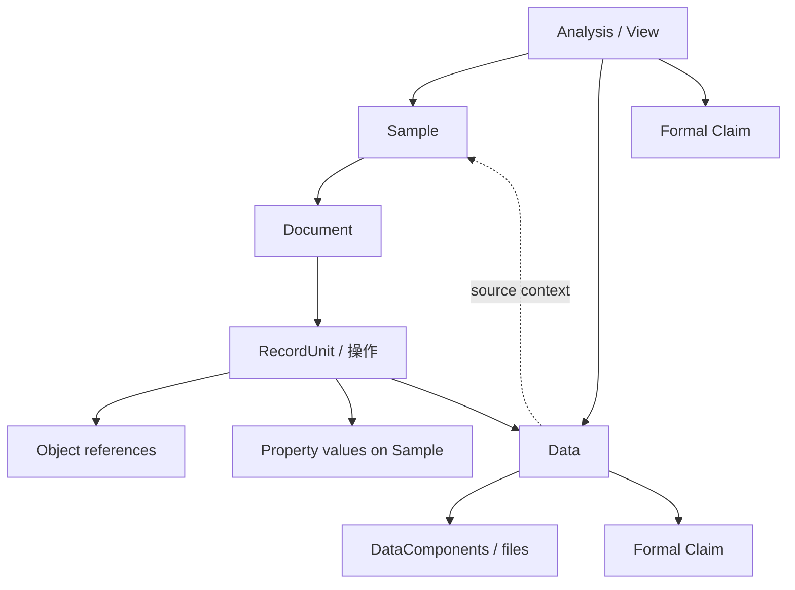

# 科研工作台当前设计规则

> 版本：v0.4  
> 更新时间：2026-09-11  
> 当前原型：[index.html](./index.html)（原型行为不等于已实现能力）

本文是当前有效规则的唯一来源。讨论过程和被替代方案见 [DISCUSSIONS.md](./DISCUSSIONS.md)，验收项见 [TEST_PLAN.md](./TEST_PLAN.md)。规则状态沿用 README 中的“已确认 / 建议 / 待讨论 / 已替代”。实现状态见 [IMPLEMENTATION_STATUS.md](./IMPLEMENTATION_STATUS.md)。

## 1. 核心模型与关系

### CORE-001 · Document-first（已确认）

Sample 的原始 Scientific Document 是操作记录的事实源，对象引用和样品属性由确定性 Parser 生成投影；解析失败不影响正文保存。此原则不意味着所有实体都只能从 Sample 文档产生：Data 可独立导入，Analysis/View 可直接编辑，正式 Claim 在 Data/Analysis 页面创建。

同一 Data 在样品区块与 Data 页面使用同一身份、多入口同步内容；首版历史限定为正文快照和正式论点的证据快照，不建设跨实体历史回滚。用户编辑导致的 Data 同步是显式内容更新，不属于 Parser 自行改写正文。保存时检查版本，避免旧页面静默覆盖；具体提交与冲突展示方式在编码计划中确定。补全菜单只帮助输入，最终按正文的有效语法解析。

### CORE-002 · 对象与样品属性（已确认）

一个 Sample 对应一份 Document。Object 提供稳定身份；Sample 拥有实际的“对象—属性—值”。属性值保留关联对象、来源操作、原文位置与 revision，不写成资源对象的全局属性。

对象的推荐属性、量纲和单位只帮助填写，不限制属性归属。即使写成 `[搅拌器]｜添加量：5 g` 也正常保存。科学合理性、事实核查由人工和 AI 完成；软件仅进行语法解析、引用匹配和明确的结构检查。

### CORE-003 · 对象关系图（已确认）



正式 Claim 从 Data 或 Analysis/View 创建并保留 host。来源上下文用于追溯，不等于论点已经被证明。

## 2. Sample 与操作编辑器

### EDIT-001 · 父 bullet 的语义（已确认：引导建议，不强制）

建议用户让一个一级父 bullet 记录一个完整操作，例如一次搅拌、一次加热、一次添加或一次测试；不要把过于复杂的复合操作塞进一个父 bullet。这个建议不由程序强制拆分。

父级可以同时声明本次操作涉及的原料、样品、过程和设备：

```text
- 使用 [磁力搅拌器]，将 [水] 加入 [样品A]，进行 [搅拌]
  - [水]｜添加量：80 g
  - [磁力搅拌器]｜档位：2
  - [搅拌]｜转速：500 rpm｜时间：30 min
```

### EDIT-002 · 层级与属性语法（已确认）

Sample 编辑器默认使用 Bullet Editor，可显示为折叠列表，不要求用户手输 `-`。

- 一级 bullet = 一个 RecordUnit / 操作。
- 二级 bullet = 对父操作中对象或 Process 的属性和值，或一个 Data 行。
- 属性行用 `[对象]` 选择归属对象，再用 `｜属性名：属性值` 连续填写多个属性。
- Enter 创建同级 bullet；Tab/Shift+Tab 调整层级。
- 普通科研结构最多两层；Data 子级是受限的第三层，只承载文件附件或普通文本。

属性值属于当前 Sample 的实际记录，不会改写原料、设备或 Process 的全局属性。

### EDIT-003 · 复合操作提醒（已确认）

同一父 bullet 子树中，同名/同一对象多次出现，并且同一属性有不同文本值时，解析后轻量提醒：

> 此操作中，“水”的“添加量”有多个不同记录，请检查是否需要拆分操作。

不阻止保存、不自动拆分、不覆盖值。父级声明对象、子级只填写一次属性不会误触发；不同属性或相同文本值不触发。首版只比较文本，`1 g` 与 `1000 mg` 视为不同，不做单位等价或科学语义判断。

### EDIT-004 · 普通文本与粘贴（已确认）

完全没有对象引用语法的普通文本、语音转写和粘贴内容都必须完整保存。Parser 不因普通文本而偷偷创建对象；自由文本若要结构化，可由 AI 转换为规范文档后再走同一个确定性 Parser。

### EDIT-005 · 子级补充对象（已确认）

子级引用父级未声明的对象时，正常解析并把有效属性记录到 Sample；操作引用包含该对象，轻量提醒补充父级，不自动改写父级。例如父级没有水，子级 `[水]｜添加量：80 g` 仍有效。

### EDIT-006 · 中文输入法与菜单（已确认：首版方案）

属性输入 `｜` 或 `|` 后，先显示最近使用，再补充高频项并去重；键入后模糊搜索标准名和手动别名。对象/类型补全由左方括号触发。

中文输入法组词和选字期间不刷新菜单、不抢方向键或 Enter、不替换正文；输入确认结束后再用完整查询搜索。先输入数字、英文或符号，再切中文也遵循此规则。Esc 关闭菜单不影响继续填写与正文解析。

### EDIT-007 · 统一行类型标记（已确认）

对象用 `[名称]`，Data 和 Claim 分别用行首 `[数据]`、`[论点]`，也接受对应的中文/全角成对方括号。输入左括号的同一菜单提供对象结果和“数据行”“论点行”选项，选中自动闭合。

“数据”“论点”保留为行首类型标记，不能在该位置再解释为同名普通对象；对象命名冲突的具体 UI 待讨论。Sample 内的论点仍只保存文本，正式 Claim 入口按 CLAIM-001 至 CLAIM-003。旧 @ 语法不再作为当前标准，原型迁移另行处理。

## 3. Object mention 与 Picker

### OBJ-001 · 单括号引用语法（已确认，替代旧 @ 语法）

对象统一写作 `[标准名]`。接受成对的 `[名称]`、`【名称】`、`［名称］`；补全统一插入 `[标准名]`。名称允许空格、数字、连字符和圆括号，不强制用连字符替换空格；首版不支持嵌套方括号。普通备注用圆括号，圆括号不触发引用。

输入左方括号打开补全；选中结果自动补全右括号，光标落到右括号后。括号持久化保存，UI 可淡化符号并给名称加轻量背景。纯文本完整引用按唯一标准名精确绑定；找不到或存在同名对象时待绑定，不自动创建。错配括号如 `[名称】`、未闭合括号保留为普通文字。

名称可直接编辑；修改就解除旧绑定并重新匹配，破坏括号完整性后退回普通文本。编辑当前引用不影响其他引用或对象本身的名称。

### OBJ-002 · 全局搜索范围（已确认）

Object Picker 把 Sample、原料、设备、Process 和未来可引用 Object 放在同一个搜索空间，结果右侧用 role 胶囊标示类型。Sample 可以搜索和引用，但不能通过引用菜单创建。

### OBJ-003 · 创建意图（已确认）

没有合适结果时显示“使用「xxx」创建原料 / 设备 / 过程”，不显示创建样品。选择创建项先把明确的 create intent 写入文档或待处理解析结果；对象提交在解析事务中完成，避免输入中途产生误创建对象。

### OBJ-004 · 废弃对象搜索（已确认）

废弃对象不隐藏、不折叠、始终可搜索，但显著降权并标记“已废弃”。有正常匹配时排在后面；无正常匹配时仍可选择。

### OBJ-005 · 匹配排序（建议）

建议排序：精确名称 > 前缀 > Alias > 包含 > 模糊匹配 > 最近/常用 > 已废弃对象 > 创建项。具体相关性权重仍可调整。

## 4. 保存、解析与结构化投影

### PARSE-001 · 及时保存、完成编辑后提取（已确认，替代离开操作即解析）

编辑期间及时 autosave 正文，持久化“提取结果待更新”状态；不必每次离开父 bullet 就提交结构。完成编辑、离开页面或切换 Sample 后，基于最新已保存正文提取并更新文件头与数据库索引。编辑期间沿用上次结果，并轻量提示“编辑完成后更新”。

浏览器直接关闭或崩溃不依赖离开事件完成解析；下次启动检查待更新文档并重试。解析失败不影响已保存正文。打开关联 Data、导出分析、通过 API/MCP 读取最新结构前，先处理相关待更新文档；未成功时不能把旧索引当作最新结果返回。

### PARSE-004 · 保存时间参数（建议）

autosave debounce 300–800 ms 保留为待性能验证建议。首版不要求短 idle 自动提取，也不要求离开操作子树立即提取；主要触发条件按 PARSE-001。

### PARSE-002 · 整篇提取与重复执行（已确认：首版方案）

首版在完成编辑后提取当前样品整篇文档，RecordUnit 仅是来源操作，不要求逐操作增量解析。有效部分正常提交，无效部分保留文字；单段语法无效不阻止其他有效段。解析执行/存储失败与语法无效分开处理，失败保留待处理状态。

同一段重复解析更新已有记录，不重复创建对象、属性值或 Data。来源操作、Data 区块和明确创建意图需要稳定标识；具体保存格式和重试幂等机制在编码计划中确定。旧解析结果不得覆盖新正文对应的文件头/索引。

### PARSE-003 · 编辑预备动作与延迟创建（已确认）

选中已有对象时记录对象身份；选择“创建原料/设备/过程”时记录名称、类别和临时创建标识。填写有效新属性、数据行也可先记录创建所需信息，完成编辑解析提交时才创建/更新。输入中不必完成永久数据库事务；未完成或无效文字不产生属性条目。

未匹配/重名对象保留文字并提示待绑定，不自动猜测或创建。文件上传是例外，必须当时可靠落本地，之后再建立正式 Data 关联。部分有效结果正常提交；创建、重试和撤销不得产生重复数据。

### PROJ-001 · 隐藏文件头与轻量数据库（已确认）

样品文件包含“元数据头＋正文”。用户所说的表头是文件本身的元数据区；样品详情直接进入编辑器，编辑器只渲染正文，不展示文件头。数据库列表可展示文件头中的提取属性并跳转来源。

元数据分为稳定信息（样品 ID、代码、必要绑定/区块标识等）和可从正文重建的提取结果（对象、文本属性值、来源位置、待更新状态等）。提取只更新机器维护的文件头与数据库索引，不自行改写正文。用户修改 Data 引起的同步更新按 DATA-004 处理。

数据库服务于检索和跳转，不另造一套需要用户维护的科学事实关系。当前协议和区块 ID 约定见 [`docs/FILE_FORMAT.md`](./docs/FILE_FORMAT.md)；文件与索引的一致性由本机服务的版本检查、原子写入和重建入口维护。

## 5. Data

### DATA-001 · Data 与文件（已确认）

一个 Data 是独立科学意义的数据单元，不等同于文件。它可包含描述、raw file、processed series、plot、image、AI trend description 等 DataComponent。Sample 中的示例：

```text
- 使用 [红外光谱仪] 进行 [红外测试]
  - [数据] 红外测试结果｜编号：FTIR-260910-01
    - raw.csv（上传后的附件行）
    - processed.png（上传后的附件行）
```

一个文件一个子 bullet，附件由专用组件呈现，不把文件名重新解析为对象引用。Data 页直接导入默认名为 `YYYY-MM-DD-数据`。About 与采集上下文需要保留；多 Sample About 的具体语义和交互待讨论。

### DATA-002 · Data 子级（已确认）

Data 的受限子级可以承载文件附件和普通文本。样品编辑器中的 `[论点]` 即使出现在 Data 子级，也只作为文本，不生成正式 Claim。

### DATA-003 · 外部 AI 派生组件（边界已确认；提议工作流待定）

应用不内置 AI。外部 AI 经 API/MCP 可新增派生 component，保留来源信息，不覆盖 raw。事实/趋势描述属于 Data，机理解释通过正式 Claim 入口记录。

先前 proposed/accepted/rejected 的提议 UI 和完整 Data revision 链只是建议，不是首版已确认功能。外部 AI 读写调用同一套应用操作规则；具体组件元数据、权限及是否设置提议状态在接口计划中确定。

### DATA-004 · 多入口同步、版本检查与移除引用（已确认）

Sample 区块与 Data 页面共用同一 Data，名称、描述、组件/附件同步。每次提交检查更新版本，避免旧页面静默覆盖新内容。该版本号用于并发检查，不要求提供通用历史浏览/恢复。

删除样品中的 Data 区块只移除当前文档引用；独立 Data、已上传文件和原始来源追溯保留。删除操作父 bullet 会移除其子级与文档引用，不级联销毁独立 Data/文件。修改父 bullet 时保留未修改对象的属性和该操作的 Data 引用。附件真正清理使用专门入口，检查 Data 与论点证据仍有无使用。

## 6. Claim

### CLAIM-001 · Sample 中的 `[论点]`（已确认）

Sample 编辑器任何层级的 `[论点]` 都作为文本保留，不创建 Claim、不进入 Claim 数据库。就地提示：

> 只有在数据或分析页面记录的论点，才会正式保存为可引用的论点。此处记录缺少直接的证据关联，仅作为文本保留。

### CLAIM-002 · 正式 Claim 入口（已确认）

只有 Data Detail 和 Analysis/View Detail 的 Claim Editor 能创建正式 Claim。Claim 数据库不提供全局“新建”按钮。

### CLAIM-003 · Claim host 与证据快照（已确认）

Claim Editor 复用 Bullet Engine：一级 bullet 中用 [论点] 标记正式 Claim，二级为属性；普通文字不自动成为论点。Data 中创建 host 为当前 Data，Analysis 中创建 host 为当前 View。

分析浏览最新内容，正式创建论点时保留所用证据的当时版本/实际内容快照。之后 Data 更新不得静默改变已记录的证据；快照引用的附件内容必须可读取。快照范围、格式及后续修改论点的行为在编码计划中确定。host 是来源/上下文，不等于论点已被证明。

## 7. Sample 数据库与 Analysis/View

### SAMPLE-001 · 样品编号和复制（已确认）

Sample 当前只要求编号。缺省编号为 `YYMMDD-01`、`YYMMDD-02`……，使用当天最大流水号加 1，不复用废弃或删除编号；手改编号必须唯一。复制 Sample 时复制 RecordUnit、对象/Process 引用、条件属性和步骤结构，不复制 Data、DataComponent/文件、Claim 及其属性。批量新建以去结果模板为基础，一行生成一个拥有独立 Document 的 Sample。

### SAMPLE-002 · 动态属性表（已确认）

列来自 `Object + Property` 投影，例如 `[水] 温度`、`[水] 添加量`。长对象名和属性名分别省略，hover 显示完整名称；列可拖拽排序，单元格居中。

首版属性值全部保存为文本，多值用 `80 g · 20 g` 并列显示；底层保留每条独立值及来源，`·` 只是显示分隔符。取消内置 sum 和其他聚合、数值推断、单位换算及数值范围筛选。首版支持文本搜索/筛选；未来分析能力从原始文本提取数值。

### VIEW-001 · 组织、比较、记录与 AI 上下文导出（已确认）

View 引用 Sample、Data、Claim、Resource/Process，不拥有这些独立对象。Sample/Data 多选可新建分析并进入详情。首版重点是组织材料、比较文本属性、记录分析和论点，浏览最新数据；不要求内置 AI 或自动科学分析。

提供快速导出，包含该分析涉及样品和 Data 等文档的实际正文、关联标识、来源与附件清单，不能只给对象名称/链接。导出前处理相关待更新文档，外部 AI 可通过接口继续读取附件。图表/文件可作为外部分析产物纳入；具体打包格式和对引用扩展的范围在编码计划中确定。

## 8. 资源、属性和范围边界

### RES-001 · 资源对象模型（已确认）

原料和设备可以共享 ResearchObject 底层模型，通过 role/tag 区分；Process 保留独立语义能力，但编辑器统一使用方括号引用。已有 Sample 可以用 `[名称]` 引用，但不能通过引用菜单内联创建；外购基材、粉体等未在工作台产生的实体按原料/资源处理。

### RES-002 · 全局属性字典（已确认）

全部对象共用一套属性字典，服务于补全及可选的量纲、推荐单位提示。创建只要求名称；量纲、单位、别名可稍后补充，不从值中自动推断，也不作科学适用性或单位校验。

别名由用户或 AI 明确写入。软件不分析近义词、不自动合并。别名参与菜单模糊搜索，选中后正文插入标准名；未选择结果时按实际正文精确匹配标准名，否则创建新属性，不通过别名静默绑定。属性字典的合并功能暂不实现，后续再讨论；Object 的历史合并方案单独保留。

### PROP-001 · 严格属性语法与自动创建（已确认）

有效行示例：`[水]｜添加量：5 g｜温度：室温`。属性段严格为“竖线＋属性名＋冒号＋值”，接受 `｜` / `|` 与 `：` / `:`，可混用；去掉首尾空白后名称和值均须非空。值可含冒号，不允许竖线；竖线始终开始下一段属性，首版不支持竖线转义。

`｜添加量：5 g` 有效；`｜添加量：` 或 `｜添加量 5 g` 不形成属性，保留普通文字。各段分别解析，无效段不影响其他有效段。正文完整保存，不强制改写格式。

不必使用补全菜单。完成编辑后的文档解析提交时，按实际填写的属性标准名精确匹配；没有则创建全局属性定义及当前 Sample 的文本值，不弹窗。未填完或格式无效时不创建字典条目；对象的绑定/创建遵循 OBJ-001、OBJ-003。

### PROP-002 · 灰色填写提示（已确认：首版简单方案）

选中属性后插入 `｜标准名：`，光标留在冒号后。字典配置了单位时，可在空值位置显示灰色“请输入值，推荐单位 g”；没有配置则不显示。提示不进入正文、不产生属性值，开始输入后隐藏。

量纲可在补全菜单中展示。不做持续跟随数值末尾的智能补写、不自动插入单位，不校验实际值是否符合提示。

### SCOPE-001 · 每日文档（已确认）

当前不做独立的“每日文档”。工作台不要求用户所有科研记录都在应用内完成；用户可以在任意地方写、语音输入或让 AI 整理后再进入 Sample Document。产品重点是稳定对象、结构化 Data、Sample、Analysis/View、Claim 和科研关系。

### SCOPE-002 · 首版运行范围（已确认）

首版面向个人，本机运行、浏览器使用；使用一个明确的数据目录。附件先本地保存，可按 STORE-001 至 STORE-004 使用 S3 兼容存储；团队账号、共享权限和实时多人协作后置。目标是细节完整、可实际使用的首版，样式和性能可试用调整；技术栈、具体目录布局和启动方式在编码计划中确定。

## 9. Object 生命周期

### LIFE-001 · Rename（已确认）

Object 使用稳定 `id`、`canonical_name`、`role`、`lifecycle`。改名只更新 canonical name；ReferenceOccurrence 仍指向相同 ID；过去的正文快照 不重写；可保留用户原始 `raw_text` 作为 provenance，UI 显示最新名称。

### LIFE-002 · Merge（已确认）

重复 Object 支持合并：所有 ReferenceOccurrence 从 `old_id` 重定向到 `canonical_id`；旧对象标记 `merged/deprecated` 并保存 `redirect_to`；历史正文不改写；当前 UI 通过 resolver 显示 canonical object；Projection 自动重算。

### LIFE-003 · Deprecate 与永久删除（已确认）

第一次删除标记 Deprecated，历史引用仍可打开并显示“原名称（已废弃）”。再次删除只有在没有 inbound references，或引用已被明确处理后，才允许永久删除；永久删除后不得存在 dangling reference。废弃对象仍可 Rename/Merge。

## 10. 更新、历史、AI 与存储

### EDIT-008 · 当前值与来源操作（已确认）

修改属性值即更新当前值，不保存第二条当前值或独立属性历史。删除属性文字后不再提取该属性，字典定义保留。删除父 bullet 同时移除子 bullet 及对应提取结果；字典对象、Data 和文件只解除文档引用，不因此销毁。

修改父 bullet 保留未修改对象的属性和关联 Data；若子级仍引用父级不再出现的对象，按 EDIT-005 提取并提醒，不级联删除其子级。三个不同操作引用搅拌代表三次操作使用；同一操作父级声明与子级填写不算额外操作。汇总入口可去重，但必须保留各操作定位。

“不保留旧属性值”指不建立属性历史库；轻量正文快照可能包含旧文字，不参与当前属性结果。

### HISTORY-001 · 最轻量正文历史（已确认）

保存过去的正文快照，只允许查看、复制。首版不做一键恢复、全实体历史回滚或附件逐版本复制。历史正文不保证还原当时所有关联对象/Data；正式 Claim 的证据快照单独负责证据固定。

建议完成编辑且正文有变化时生成一次快照；只更新文件头不新增正文历史。确切生成时机、保留数量和清理规则在编码计划中给出默认方案，不升级为通用版本系统。

### AI-001 · API 与 MCP（已确认）

应用不内置 AI。各个功能提供可供外部 AI 协作的 API 和 MCP，包括对象/属性字典、样品正文、Data/附件、Analysis、Claim、搜索、导出及存储/备份等能力；具体工具清单与敏感操作授权在编码计划列明。

界面、API、MCP 使用同一套业务操作与版本检查，不允许外部 AI 绕过语法、创建或引用规则。支持读取实际正文和附件内容、写入规范文档、明确编辑字典别名及新增派生成果。读取最新结构前处理相关待更新文档，不能返回假装最新的旧索引。

### STORE-001 · 本地优先与 S3 范围（已确认）

首版只做本地与 S3 兼容存储，网盘和 GitHub 后置。默认本地保存；S3 需要用户配置并启用。文件上传时立即可靠保存本地，不等待编辑结束。

日常自动上传只针对超过可配置大小阈值的附件，不默认全量上传，不做按类型等复杂策略。大小阈值 100 MB 目前只是建议默认值，需在编码计划明确单位与默认配置。

### STORE-002 · 大文件延迟上传（已确认）

启用 S3 后，附件同时满足“超过大小阈值”和“本地保存满 X 天”才自动上传，X 可配置、默认 15 天。年龄从首次本地保存成功起算，不因查看、引用或后台扫描重置。不做按未访问时间触发的策略。

应用关闭期间不执行，下次启动检查到期任务并继续；首版不安装常驻后台服务。应用运行时的调度间隔与任务重试在编码计划确定。

### STORE-003 · 副本策略与可靠性（已确认）

上传并核对成功后，用户可选保留本地与远端两份，或本地仅保留远端索引、查看时按需读取。上传失败保留本地文件，不影响编辑，可重试；未确认远端完整性不得自动移除本地副本。

远端索引保存稳定对象位置，不能仅保存会过期的访问链接。文件迁移位置不改变文档或证据引用。文档引用删除不联动删除 S3 文件；专门清理入口检查仍在使用的 Data/证据。

### STORE-004 · 手动全量备份与恢复（已确认）

全量备份是独立手动操作，可输出本地或上传 S3，不受附件阈值与 15 天等待限制。包含正文、字典、Data、分析、正文历史、论点证据快照和全部附件实际内容，能够独立恢复。

仅 S3 保留的附件需取回后纳入备份；不能只保存远端位置清单并称为完整备份。下载失败或内容缺失明确标记不完整，不能报告完整备份成功。凭据处理、备份一致性与恢复目标策略在编码计划中明确。

### VERIFY-001 · 完整实验样例（已确认的交付要求）

由实现方设计完整样例，覆盖创建样品、规范/不规范输入、中文输入、属性修改/删除、重复操作/解析、附件/Data、多入口版本冲突、分析导出、外部 AI 接口、证据快照和备份恢复。可以参考公开论文增强专业性，须区分文献事实与模拟验收数据，引用可核查来源。

样例是编码计划与最终验收的交付物；当前尚未创建，不视为测试已完成。

## 11. 编码准备状态

产品方向已足够开始制定 coding 计划，不需要继续扩展概念或先设计通用科研关系平台。计划必须收敛以下实施选择：

- 编辑器与文件格式，稳定区块/引用标识如何保存；隐藏元数据头与正文的读写边界。
- 及时保存、文件头/索引更新一致性、失败重试幂等；Data 版本冲突的最小交互。
- API/MCP 工具清单、连接授权、数据导出实际内容范围。
- 轻量历史与证据快照的格式/默认策略；Data About、重复引用来源和复制时普通论点文字处理。
- S3 阈值具体默认值、调度、校验、凭据保存、缓存清理、备份恢复流程。
- 本机技术栈、启动方式、数据目录与完整样例、分阶段验收。

上述实施方案可由编码计划给出建议默认值；涉及尚未决定的产品语义时只集中确认必要问题。当前仅完成文档设计，尚未选定技术栈、创建样例或实现本体。

## 12. 当前原型差异

`index.html` 保持交互草图，本轮未修改。它仍使用旧 @ 语法，部分操作只有 toast/内存状态，未验证真实持久化、Data 多入口同步、revision 与 provenance。后续实现需按单括号语法、文本属性、中文 IME、隐藏文件头、完成编辑后整篇提取、API/MCP 和本地＋S3 存储更新；原型不作为已实现证据。

## 13. 界面密度与可读性（Design v2）

### UI-DENSITY-001 · Design v2 可读性（已确认）

冻结原型仍是历史设计参考。生产工作台可以在排版和控件密度上刻意偏离冻结原型，使持久界面文字、按钮、导航和数据表格在浏览器 100% 缩放下直接可读，无需浏览器 `Cmd + +`。

除本规则外，页面几何、信息架构和交互语义保持稳定：不再以“与冻结原型逐像素一致”作为生产界面的验收目标。侧栏宽度、内容列宽（样品编辑器约 840px、详情约 980px）、980px / 640px 响应断点和样品正文科学排版不因本次可读性调整而改变。

持久生产界面文字一般不低于 10px；侧栏导航与主要控件采用更大的桌面工具尺度（导航 13px、普通按钮/工具条 12px、次级文字 11px）。浏览器缩放不是正常可读性的解决方案，禁止用根级百分比缩放、`zoom` 或 `transform: scale()` 模拟。验证方式为布局不变量、Design v2 排版值和溢出检查，并保留截图证据；不是像素回退到原型。
